# Customer 360 Data Warehouse Project

A SQL Server-based data engineering portfolio project focused on building a Customer 360 analytical warehouse from raw activity data. The project demonstrates the full data pipeline lifecycle: source ingestion, staging, dimensional modeling, ETL orchestration, data quality review, and business reporting using SQL.

## Overview

This project transforms raw customer and transactional records into a structured, analytics-ready warehouse for customer intelligence and decision support. The design reflects a classic star schema approach, where dimension tables provide context and a fact table stores measurable business events.

The solution includes:

- raw CSV ingestion
- staging and cleansing logic
- dimensional modeling for core business entities
- SSIS ETL orchestration
- data quality documentation
- SQL business queries for customer analytics

## Why this project matters

Customer 360 solutions help organizations understand who their customers are, how they behave, and what patterns drive engagement and revenue. By consolidating customer data into a warehouse, teams can answer strategic questions such as:

- How many customers are in each province?
- What is the customer profile by segment or geography?
- How do transactions and interactions differ across products or regions?
- Which behavioral patterns are linked to customer engagement?

## Architecture and data flow

The project follows a standard enterprise data warehouse pattern, converting raw operational data into structured, analytics-ready business information.

### High-level architecture

```text
+---------------------+      +------------------------+      +---------------------------+
| Raw Source Data     | ---> | Staging / Cleansing    | ---> | Dimensional Warehouse      |
| (CSV activity file) |      | (stg_customer360)      |      | (Client, Location,         |
+---------------------+      | - validation            |      |  Account, Type dims)       |
                              | - normalization         |      +---------------------------+
                              | - deduplication         |                    |
                              +------------------------+                    |
                                                                                |
                                                                                v
                                                                      +---------------------------+
                                                                      | Fact Table / Analytics     |
                                                                      | (customer activity +       |
                                                                      | transactions)              |
                                                                      +---------------------------+
                                                                                |
                                                                                v
                                                                      +---------------------------+
                                                                      | Business Questions / SQL  |
                                                                      | Reporting & Insights      |
                                                                      +---------------------------+
```

### Data flow

1. Raw customer activity data is loaded from the source CSV file.
2. Incoming data is staged into SQL Server staging tables for validation and standardization.
3. Data quality rules are applied: trimming whitespace, converting formats, handling nulls, and removing duplicates.
4. Cleaned records are loaded into dimensional tables such as client, location, account, and type dimensions.
5. The fact table stores measurable events and relationships between customers, accounts, and activities.
6. SQL-based reporting queries transform the warehouse into business insight and decision support.

### Architecture diagram

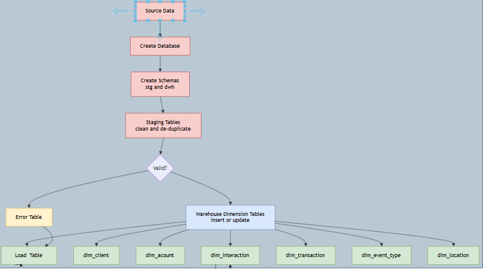

## Repository structure

- [1.raw_csv_data](1.raw_csv_data) — raw source files used for the warehouse
- [2.project_scope](2.project_scope) — project definition and scope documentation
- [3.data_modeling](3.data_modeling) — star schema and modeling artifacts
- [4.ssis_pipeline_customer360](4.ssis_pipeline_customer360) — SSIS ETL packages and workflow orchestration
- [5.sql_scrips](5.sql_scrips) — database creation, staging, and warehouse SQL scripts
- [6.data_quality_note_description](6.data_quality_note_description) — validation and quality notes
- [7.business_questions](7.business_questions) — SQL queries answering business use cases
- [8.screenshots](8.screenshots) — screenshots of the ETL process and warehouse objects
- [9.presentation](9.presentation) — presentation deck summarizing the project

## Data warehouse design

The warehouse is modeled using a star schema centered on customer activity and business events.

### Core dimensions

- Client
- Location
- Account
- Transaction type
- Event type
- Interaction type

### Fact layer

The fact table stores transactional and engagement events connected to customer and dimensional context, enabling multi-dimensional analysis and business reporting.

## ETL pipeline

The ETL workflow is implemented in SSIS under [4.ssis_pipeline_customer360](4.ssis_pipeline_customer360). It orchestrates the load process from source-to-staging-to-dimension-and-fact structures.

Included package workflow:

- 0.1_create_database.dtsx
- 0.2_dim_client.dtsx
- 0.3_dim_location.dtsx
- 0.4_dim_account.dtsx
- 0.5_dim_transaction_type.dtsx
- 0.6_dim_event_type.dtsx
- 0.7_dim_interaction_type.dtsx
- 0.8_fact_table.dtsx
- 1_Master.dtsx

## Screenshots

These images document the implementation and warehouse build process:

### Data modeling screenshot

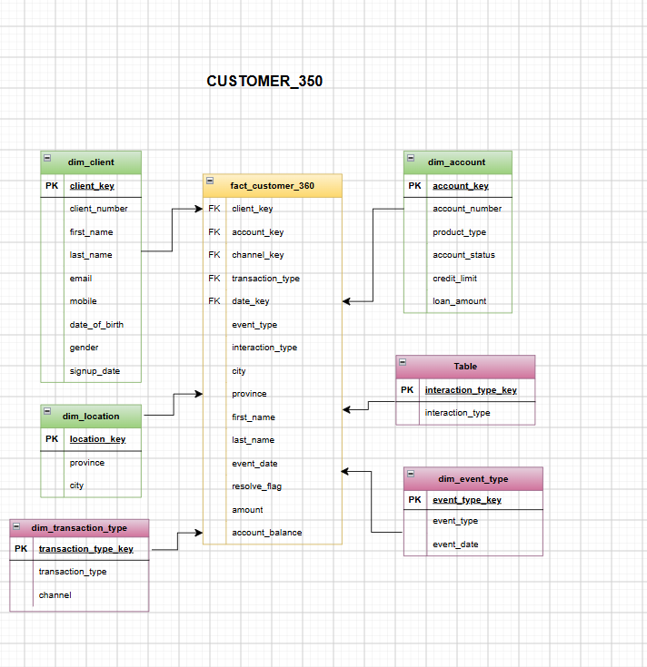

### ETL and warehouse build screenshots

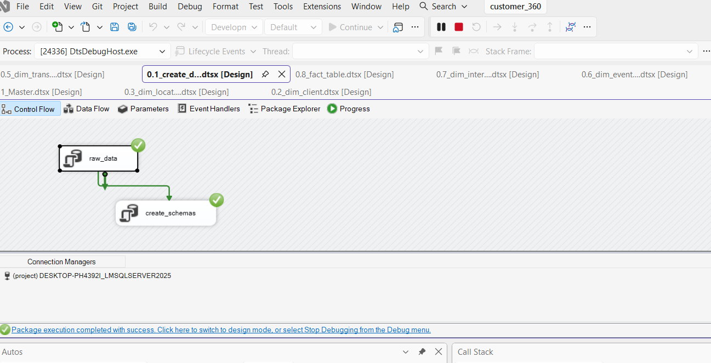

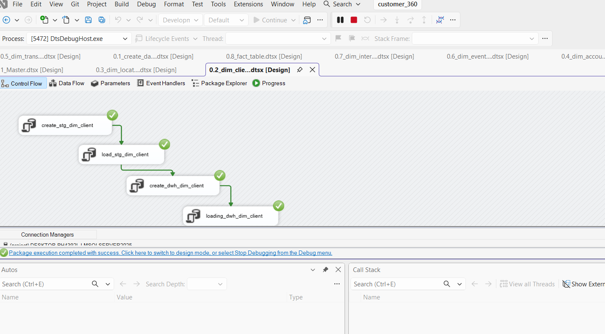

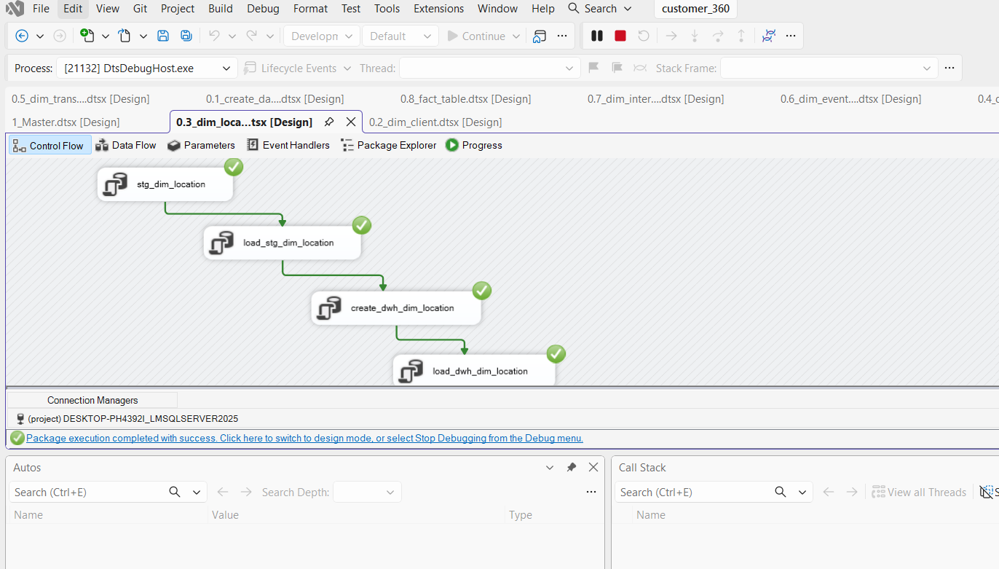

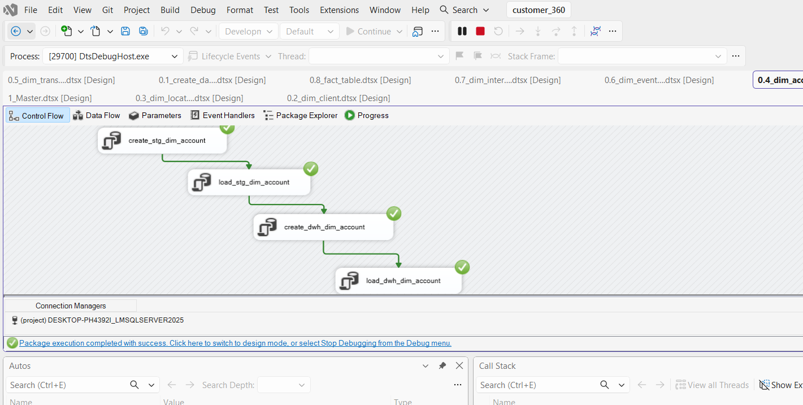

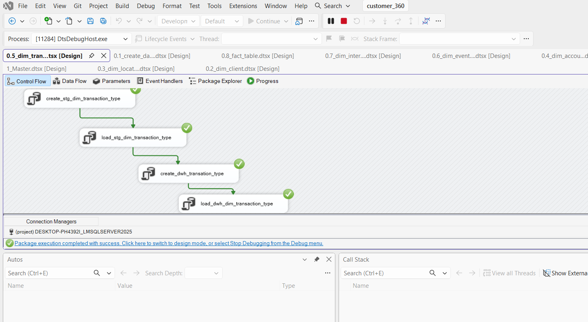

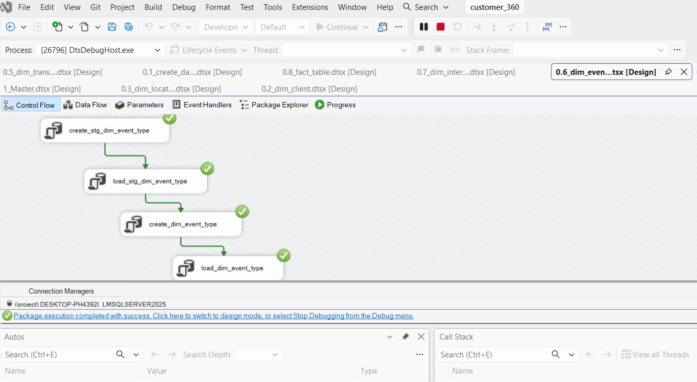

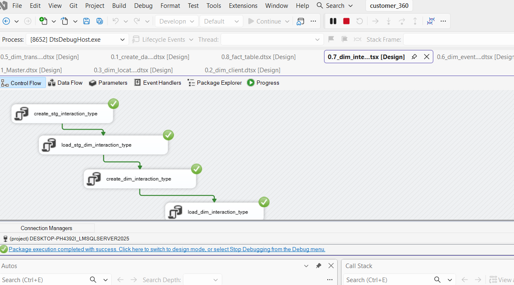

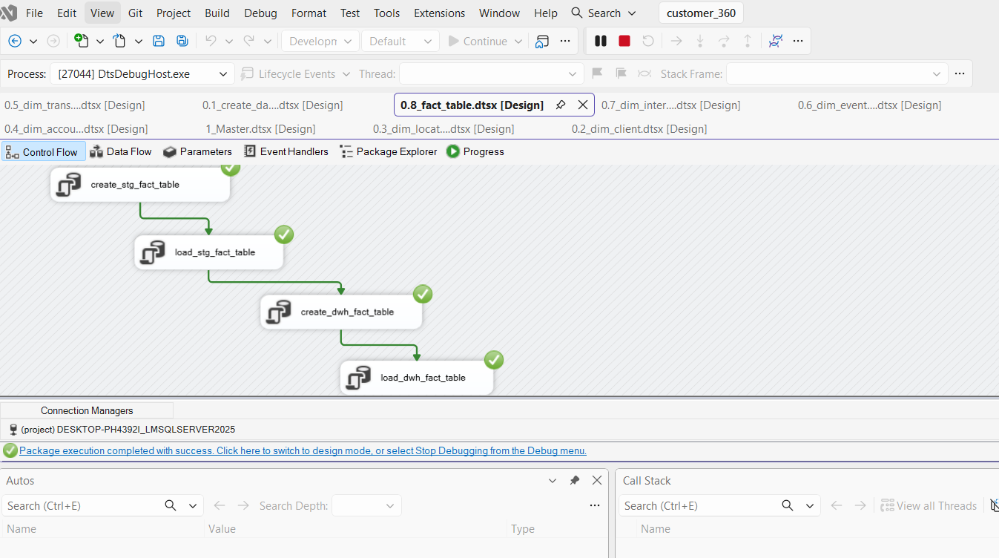

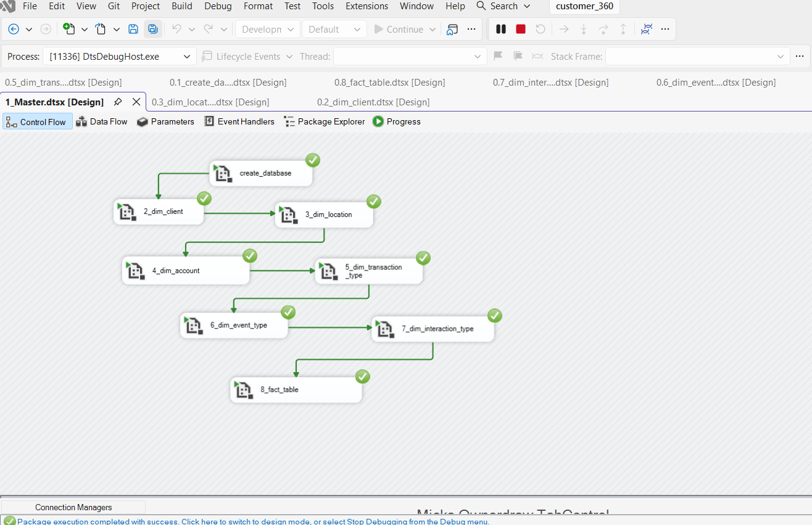

## SQL assets

The SQL code in [5.sql_scrips](5.sql_scrips) handles the database creation and DW load logic, including:

- staging schema creation
- dimension table creation
- fact table creation and population
- warehouse setup and transformations

The business questions in [7.business_questions](7.business_questions) provide practical analytical scenarios using the final model, including customer base, product, transaction, and engagement analysis.

## Business use cases covered

Examples of analysis implemented in the project include:

- customer distribution by province
- transactional summaries
- product and customer segmentation
- engagement and interaction patterns
- additional business insight queries

## Tech stack

- SQL Server / T-SQL
- SSIS for ETL orchestration
- CSV source files
- Star schema dimensional modeling
- SQL-based analytics and reporting

## Getting started

To run or extend the project:

1. Open the SQL Server environment and create the required database objects.
2. Run the scripts in [5.sql_scrips](5.sql_scrips) in the correct sequence.
3. Execute the ETL packages in [4.ssis_pipeline_customer360](4.ssis_pipeline_customer360).
4. Query the warehouse using the files under [7.business_questions](7.business_questions).
5. Use [8.screenshots](8.screenshots) and [9.presentation](9.presentation) to review the design and deliverables.

## Project outcome

This project represents a complete end-to-end data engineering workflow: raw data ingestion, transformation, dimensional modeling, ETL deployment, and analytical query delivery. It is a strong example of a practical Customer 360 warehouse built for a data engineering and analytics portfolio.

## Summary

This repository showcases hands-on experience in building a modern data warehouse with SQL Server and SSIS, with a clear focus on real-world business reporting, dimensional modeling, and data quality handling.
